# SemanticKernelLearningApp

## Overview
SemanticKernelLearningApp is a .NET application designed to demonstrate various functionalities of Semantic Kernel through a menu-driven interface. This project includes several agents, plugins, and planners to provide a comprehensive learning experience.

## Table of Contents
- [Setup Environment Configuration](#setup-environment-configuration)
- [Menu Items](#menu-items)
    - [Example for Each Menu Item](#example-for-each-menu-item)

## Setup Environment Configuration
1. **Clone the repository:**
     ```sh
     git clone https://github.com/Pratik-Shah/SemanticKernelLearningApp.git
     cd SemanticKernelLearningApp
    ```

2. **Create Azure Service Principal:**
Create an Azure service principal for local development.

   ```sh
   az ad sp create-for-rbac --name "your-app-id" --scopes /subscriptions/{subscription-id}
   ```

3. **Assign the Reader and Tag Contributor roles to the service principal for resource group as per your needs:**
   ```sh
   az role assignment create --assignee "your-app-id" --role "Reader" --scope /subscriptions/{subscription-id}/resourceGroups/{resource-group-name}

   az role assignment create --assignee "your-app-id" --role "Tag Contributor" --scope /subscriptions/{subscription-id}/resourceGroups/{resource-group-name}
    ```
4. **Create Azure OpenAI Service resource**.

    Follow to create azure openai service resource.  https://learn.microsoft.com/en-us/azure/ai-services/openai/how-to/create-resource?pivots=web-portal

    **Note:** 
    - This application is tested against **gpt-4-1106-preview model using Standard pricing tier.**
    - Make sure to copy the API key, endpoint, and version of the resource.

    

5. **Set up the environment variables:**
    Update .env file in the LearningApp directory with the following content:
     ```sh
    cd LearningApp
    ```
     ```sh    
    AZURE_CLIENT_ID="$YOUR_AZURE_CLIENT_ID$"
    AZURE_TENANT_ID="$YOUR_AZURE_TENANT_ID$"
    AZURE_CLIENT_SECRET="$YOUR_AZURE_CLIENT_SECRET$"
    AZURE_OAI_ENDPOINT="$YOUR_AZURE_OAI_ENDPOINT$"
    AZURE_OAI_API_KEY="$YOUR_AZURE_OAI_API_KEY$"
    AZURE_OAI_API_VERSION="$YOUR_AZURE_OAI_API_VERSION$"
    AZURE_OAI_DEPLOYMENT="$YOUR_AZURE_OAI_DEPLOYMENT$"
    ```
6. **Building and Running the Project:**
    To build and run the project, use the following commands:
    ```sh    
    dotnet build
    dotnet run
    ```

## Menu Items
The application provides various menu items to interact with different functionalities of the Semantic Kernel. The user can select any menu item to perform the desired operation. The following is the list of menu items available in the application:

### Example for Each Menu Item

1. **Perform Kernel Invocation**
- Description: Executes a kernel invocation having ToolCallBehavior set to EnableKernelFunctions. Any corresponding tool calls will be evaluated by the model and responded back with required call to be made along with inputs. The user can then make the call and get the response.

- Example:
    - User Input: "Give me list of rivers of India"        
    - Response:
    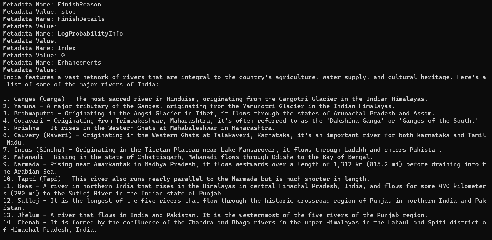
        
    - User Input: "list all keyvaults"
    - Response:
    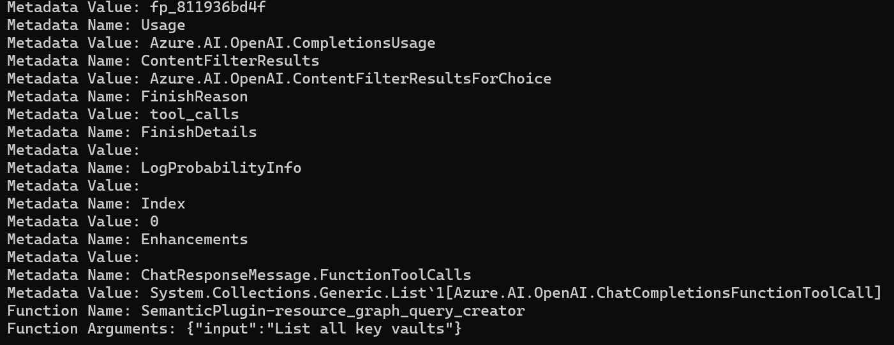

2. **Display Kernel Plugins**
- Description: Displays information about the  different native and semantic (prompt) function added to the kernel as plugin. You can follow the source code to see the structure of the plugin and how it is added to the kernel.

- Example:
    - User Input: No user input required.
    - Response:
    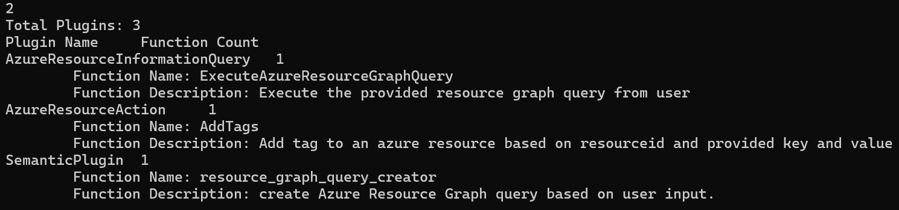

        
3. **Execute ChatCompletion with Plugin**
- Description: Execute chat completion with a plugin.
- Example:
    - User Input: "get all keyvault in my subscription"
    - Response: 
    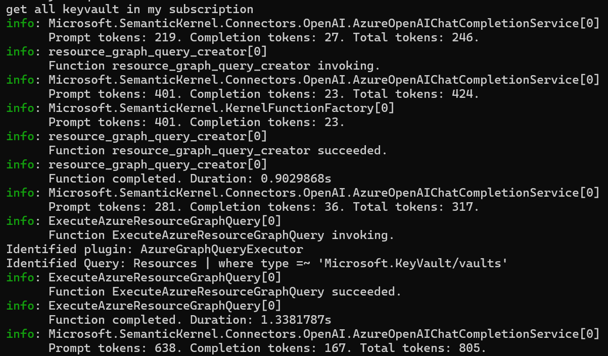
    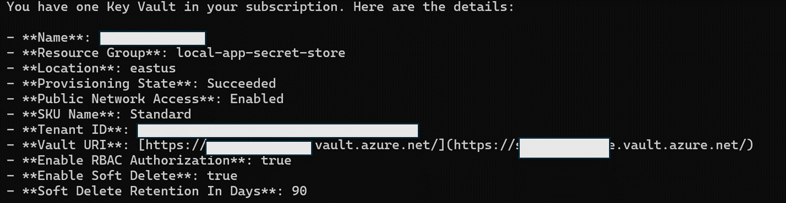

4. **Execute FunctionCallingStepWise Planner**
- Description: Execute the FunctionCallingStepWise planner which is based on ReAct pattern. The planner will createa a plan and execute it step by step and provide the response to the user.
- Example:
    - User Input: "get name of stroage and resourcegroup under which it is provisioned"
    - Response: 
    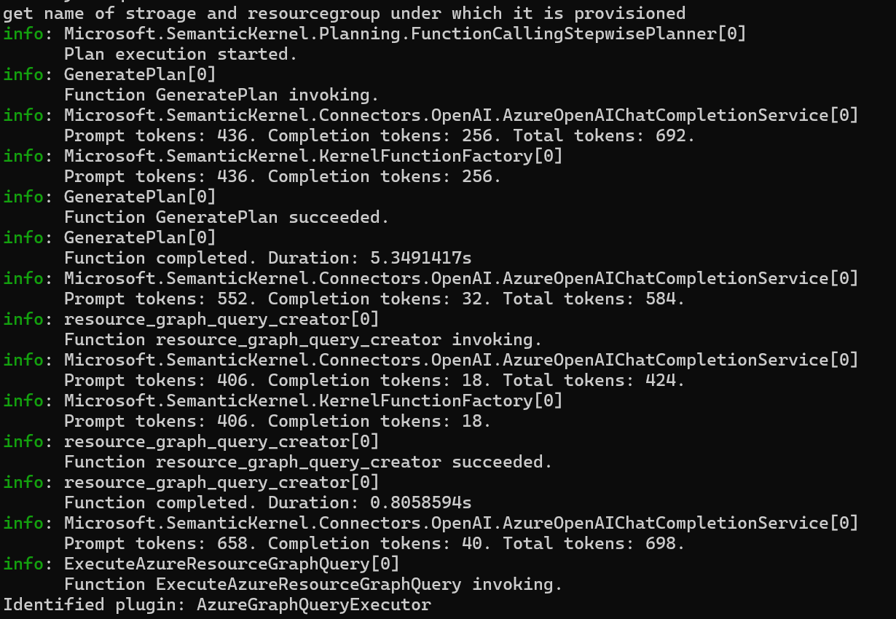
    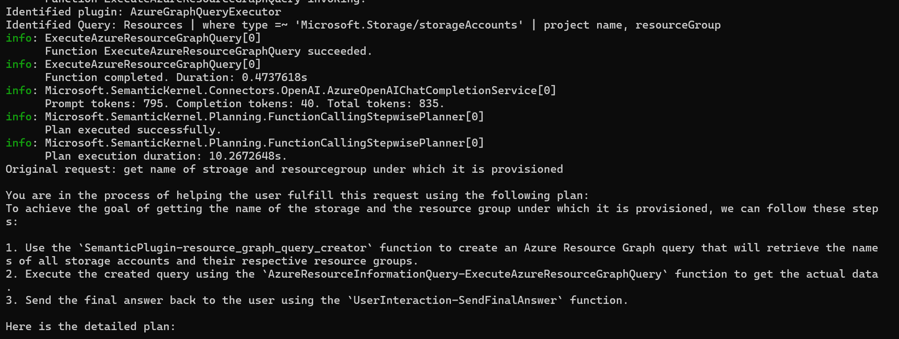
    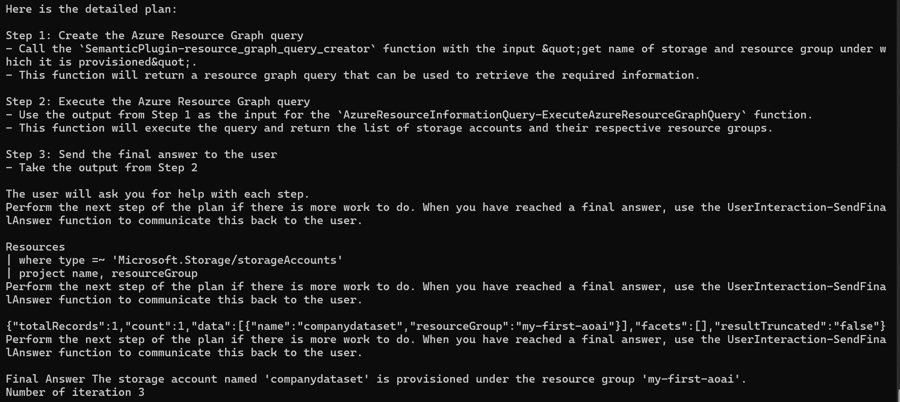

5. **Execute Handlebars Planner**
- Description: This example demonstrates the use of Handlebars planner to generate a query based on the user input.  **Note:** This example doesn't execute the query but just shows how the query is generated.

- Example:
    - User Input: "list all resource in eastus"
    - Response: 
    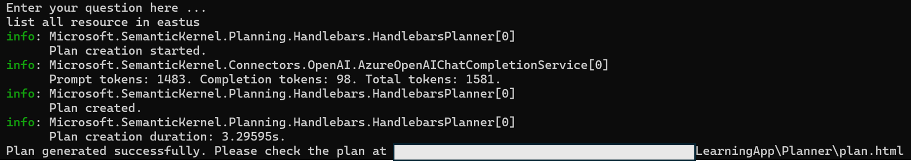
    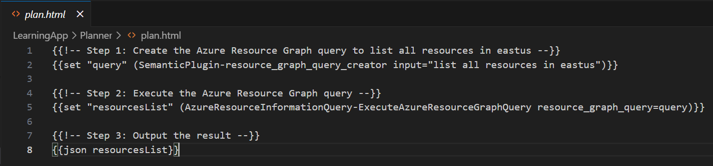
    
    
6. **AI Agent Execution** : TBD
    

7. **Agent Delegation Execution**
- Description: Execute the agent delegation.
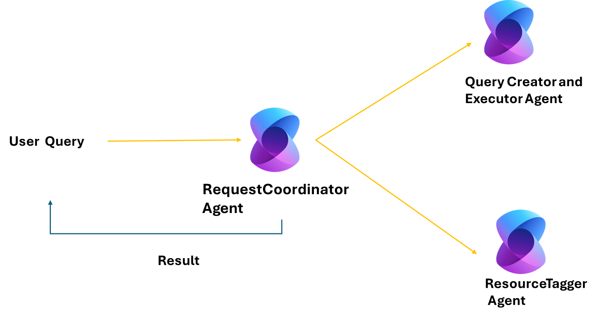
- Example:
    - User Input: "Tag all storage  in my subs with key "agent" and value "assistant-03-08-204""
    - Response: 
       
    ```markdown    
    Bootstrapping the agents...
    Bootstrapping completed....
    Enter your query here...
    Tag all storage  in my subs with key "agent" and value "assistant-03-08-204"

    # Identified plugin: AzureGraphQueryExecutor
    # Identified Query: Resources | where type =~ 'Microsoft.Storage/storageAccounts' | project id
    
    #Identified plugin: AddTags
    #Response from the agents 2
    # user: Tag all storage  in my subs with key "agent" and value "assistant-03-08-204"
    
    # assistant: The goal is achieved. Here is the chain of history:

    1. REQUEST: List all storage accounts in my subscription.
    QueryExecutor: List all storage accounts in my subscription.
    
    The query execution has identified the following storage account in your subscription:
    - Resource ID: `/subscriptions/<MaskedSubscriuptionID>/resourceGroups/my-first-aoai/providers/Microsoft.Storage/storageAccounts/companydataset`

    2. REQUEST: Tag the resource with Resource ID `/subscriptions/<MaskedSubscriuptionID>/resourceGroups/my-first-aoai/providers/Microsoft.Storage/storageAccounts/companydataset` with the key 'agent' and value 'assistant-03-08-204'.
    
    ResourceTagger: The resource with Resource ID `/subscriptions/<MaskedSubscriuptionID>/resourceGroups/my-first-aoai/providers/Microsoft.Storage/storageAccounts/companydataset` has been successfully tagged with the key 'agent' and value 'assistant-03-08-204'.
    ```
    
          
    
    
8. **AgentGroupChat Execution**
- Description: Execute the multi agent group chat.
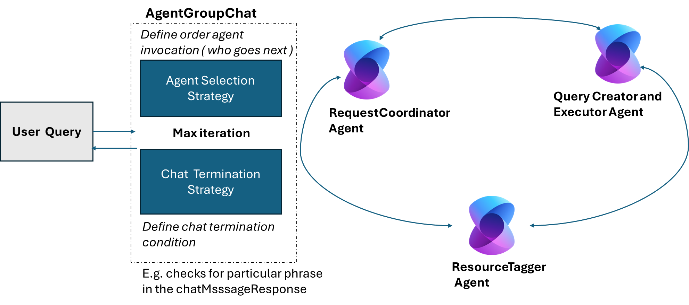
- Example:
    - User Input: "There has been some issue with the keyvaults in the subscription. As an initial step we must analyse them for which lets first tag them with key "ticket" and value "03082024" so everyone knows its under investigation."
    - Response: 
   
    ```markdown
    # user: 'There has been some issue with the keyvaults in the subscription. As an initial step we must analyse them for which lets first tag them with key "ticket" and value "03082024" so everyone knows its under investigation.'

    >>>> Next Agent Selected Reason: After user input, it is RequestCoordinator's turn.
    >>>> Next Agent Selected: RequestCoordinator
    
    # assistant - RequestCoordinator: 'To assist with tagging the Azure Key Vaults in your subscription with the key "ticket" and value "03082024," I will coordinate with the ResourceTagger agent. Please hold on while I initiate the tagging process.

    # ResourceTagger, please tag all Key Vaults in the user's subscription with the key "ticket" and value "03082024" to indicate they are under investigation.'
    
    >>>> Next Agent Selected Reason: It is time for 
    ResourceTagger to tag all Key Vaults in the user's subscription as per the instruction from RequestCoordinator.
    
    >>>> Next Agent Selected: ResourceTagger
    
    # assistant - ResourceTagger: 'To proceed with tagging the Azure Key Vaults, I need to confirm the resource IDs of the Key Vaults that need to be tagged. Could you please provide the resource IDs for the Key Vaults, or should I request the necessary details to query and identify them?'
    
    >>>> Next Agent Selected Reason: ResourceTagger needs to confirm the resource IDs of the Key Vaults, and hence requires additional information to tag them.
    >>>> Next Agent Selected: QueryExecutor

    # Identified plugin: AzureGraphQueryExecutor
    Identified Query: Resources | where type =~ 'microsoft.keyvault/vaults' | project id
    
    # Identified plugin: AzureGraphQueryExecutor
    Identified Query: Resources
    | where type =~ 'microsoft.keyvault/vaults'
    | extend Tags = iff(isnull(tags), dynamic({}), tags)
    | extend TicketTag = tostring(Tags['ticket'])
    | where isempty(TicketTag) or TicketTag != '03082024'
    | project id, name, location, resourceGroup, Tags
    | extend Tags = strcat('{"ticket":"03082024"}', Tags)
    | project id, Tags
    
    # assistant - QueryExecutor: 'The Azure Key Vault with the following resource ID has been identified for tagging:

    `/subscriptions/<MaskedSubscriuptionID>/resourceGroups/local-app-secret-store/providers/Microsoft.KeyVault/vaults/secretStorage`

    # The Key Vault will be tagged with the key "ticket" and value "03082024" to indicate it is under investigation. Please note that this Key Vault already had a tag with key "ticket" and value "02082024", which will be updated to "03082024".'
    
    
    >>>> Next Agent Selected Reason: The QueryExecutor has identified the Azure Key Vault resource ID for tagging and has provided information for the ResourceTagger to proceed with the tagging process.
    
    >>>> Next Agent Selected: ResourceTagger    
    
    # Identified plugin: AddTags
    info: AddTags[0]
        Function AddTags succeeded.
    info: AddTags[0]
        Function completed. Duration: 12.3428161s
    
    # assistant - ResourceTagger: 'The Azure Key Vault has been successfully tagged with the key "ticket" and value "03082024" to indicate that it is under investigation. If there are any more Key Vaults or other resources that need to be tagged, please let me know.'
    
    >>> Next Agent Selected Reason: After ResourceTagger completes tagging request successfully, it is RequestCoordinator's turn.
    >>>> Next Agent Selected: RequestCoordinator
    
    # assistant - RequestCoordinator: 'The Azure Key Vault has been successfully tagged with the key "ticket" and value "03082024" to indicate that it is under investigation. If you need further assistance with Azure resources, feel free to reach out. GOAL_IS_ACHIEVED.'
    ```

## Known Issues
- The application is in active development phase and may have some issues. Please retry the operation if you face any issue.

## To Do
- Exception handling.
- Improve the user experience.
- Add observability features
    - logging
    - monitoring
    - tracing
- Performance improvements.
- Unit tests.
- Include Kernel Memory usecases in the application to demonstrate the RAG functionality.
- Make the chat history more readable and user-friendly.
- Have persistent chat history.
- Code improvements and optimizattions.
- Security improvements and best practices as part of learning.
- Cloud setup and deployment to Cloud.